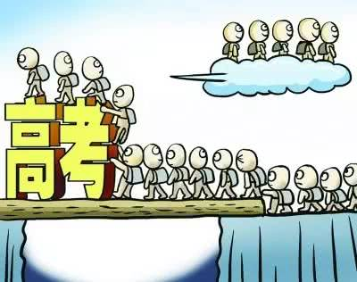

那年文人群里聊起一个话题，也不知道是谁说起来的，反正大家发现各自的经历都很相似。

都疯狂被贬。

苏轼：啊，说起贬官，我就比较有经验了，以后群里如果又有朋友被贬，不要慌。

苏辙：反正过几天就能发现当地也是有美食的。 苏轼：！！！ 苏轼：你怎么知道我要说什么！ 苏辙：大家都知道的……

苏轼：然则我并不是要说这个。 苏辙：你刚刚明明就已经承认…… 苏轼：我要说的是你只要想想，冷冰冰的世界里还有一个可爱的弟弟，你就再也不会慌了。

苏辙：？？？ 苏辙：卧槽，哥你干嘛，搞我啊！ 李清照：啊，我也想要一个弟弟。 薛涛：小奶狗也行。 鱼玄机：我还是比较喜欢大叔，说起大叔，我师父好像从来没有被贬过。 温庭筠：小鱼啊，那是因为我就没考上科举啊！

鱼玄机：哇，师父没考上科举还这么有才华，星星眼。 温庭筠：…… 鱼玄机：啊，师父我没有说你空有才华却考不上科举的意思，我真没有。 温庭筠：啊，小鱼我知道了啊。 温庭筠：而且我还是经人推荐，做过官的，也是被贬大军中的一员，我没有那么菜的啊。

罗隐：这么说起来，果然我才是最菜的。 鱼玄机：不好意思，请问你是？ 罗隐：…… 罗隐：我未成名君未嫁，可能俱是不如人。 鱼玄机：？？？

罗隐：我，十二三年不中第·扎心小王子，罗隐。时来天地皆同力，运去英雄不自由。就是我写的。 鱼玄机：哦~~ 鱼玄机：就是一首诗词都没有完整流传下来对吧？ 鱼玄机：那你的确是不如人。 罗隐：？？？

唐寅：那你的确是不如人。 徐渭：那你的确是不如人。 曹雪芹：其实大家都没怎么当过官，有没有作品完整流传下来又如何呢？还不是生时于世无补，死后万事成空。 罗隐：\[泪\]\[泪\]\[泪\]

王安石：六朝旧事如流水，但寒烟衰草凝绿。我想起我被贬官的时候，其实无官才是真的一身轻。 苏辙：？？？ 苏辙：臭狐狸你还敢出来？ 王安石：一脸懵逼。

晏殊：臭狐狸你还敢出来？ 欧阳修：孽徒，你还敢出来？？？ 王安石：……

苏辙：要不是你，我哥岂会被贬，还差点死了！ 王安石：我不是，把他救回…… 晏殊：要不是你，我儿晏几道又岂会下狱，家道沦落，尝尽人情冷暖！ 王安石：我不是，也把他救回……

欧阳修：唉，老夫惨啊，老夫好心举荐的学生却把我这糟老头子贬出京城，死在外地。 王安石：不是，您老明明是自己辞职之后悠闲……

欧阳修：我给你个机会重新组织下语言。 欧阳修从隔壁名将群朝狄青借来了把剑，默默擦来擦去。 王安石：…… 王安石：呸！一群渣渣！我变法改革容易吗，就知道拖我后腿，说我手下的人都是辣鸡，你们这群君子倒是来帮我啊，都站在干岸上说风凉话，等着看我出丑，活该被贬！

王安石：我王介甫死不认错（破音）！ 群成员王安石光速下线了。 欧阳修：？？？ 苏辙：？？？ 晏殊：？？？ 苏轼：其实吧，我被贬了，也变强了。 柳永：其实吧，我不能科举了，也变强了。 李煜：其实吧，我亡国了，我强到开一代先河。

白居易：其实吧，被贬也挺好的，被贬之后我就能跟我家微之多些共同语言了。 元稹：但你被贬的地方太偏远了，我心疼的。 元稹：垂死病中惊坐起那么心疼。 白居易：嘤嘤嘤。

刘禹锡：然而元稹毕竟是个渣男，嘴上说着心疼却一点行动都没有。 元稹：？？？ 刘禹锡：你看我家柳宗元，自己被贬到了好点的地方，但知道我被贬偏远山区，亲自上书陈情，求天子把我俩互换，他要替我去受罪。

柳宗元：惭愧惭愧，主要是担心你老母，反正不是在担心你。 刘禹锡：我知道的子厚。

李清照：嘶，这一对对的，好特么甜啊。 薛涛：我突然觉得被贬好像也不是什么坏事了。 韩愈：…… 韩愈：一封朝奏九重天，夕贬潮州路八千，真不是好玩的啊！

李白：但其实也还好，我被流放夜郎那会儿，苦闷的时候喝点酒，路上那么多朋友粉丝，总不至于半点乐趣都无。 韩愈：……谁跟你这么不正经啊！

曹操：卧槽，一会儿没登这个群，怎么话题我都有点跟不上。 曹操：被贬，啥叫被贬？ 一时间，群里突然陷入了难以言说的沉寂……

cr.房昊曰天
