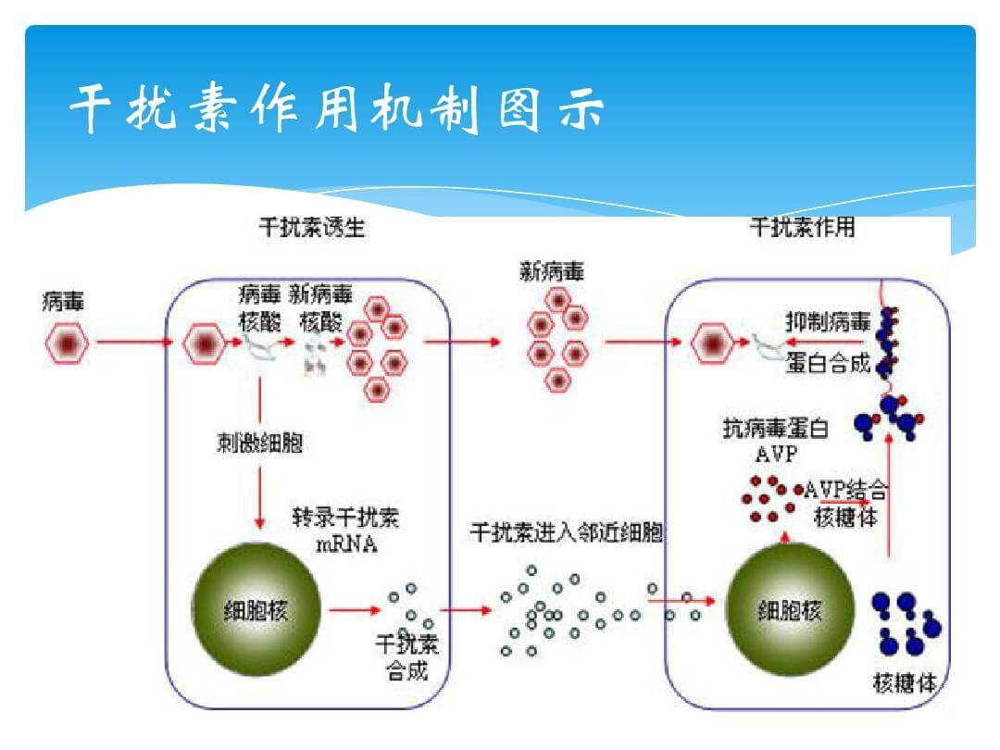

注意：题目和答案为本人所写，不保证准确性。

在近日爆发的武汉新型冠状病毒的治疗方案中，出现了干扰素的身影。干扰素有抗病毒，抗肿瘤，免疫调节功能。观察干扰素作用机制示意图，回答以下问题：

1.干扰素是最早发现的细胞因子，通过被临近细胞的\_\_\_\_\_识别从而传递信息给临近细胞，引发临近细胞的一系列反应。

2.当临近细胞接收到信息后，相应基因被激活，产生AVP起到抗病毒作用。此过程为基因的\_\_\_\_\_。

3.临近细胞所产生的AVP与核糖体结合，通过影响中心法则中的\_\_\_\_\_\_\_\_\_\_（用文字和箭头表示，标明原料和产物，在箭头上方标明过程）过程从而起到抗病毒作用。同时，AVP可以降解病毒的mRNA，这与\_\_\_的生理作用类似。

4.综上，从免疫调节的角度，干扰素属于一种\_\_\_\_\_\_\_\_。

 

 

 

 

 

 

 

。

 

 

 

 

 

 

 

 

。

 

 

 

 

 

 

 

 

。

 

 

 

 

 

 

 

 

 

 

。

 

答案：

1.受体

2.表达

3.(m)RNA---翻译--->蛋白质

酶

4.免疫活性物质

（说明：按照必修三定义推断的）

特别鸣谢mzlnlog的贡献
