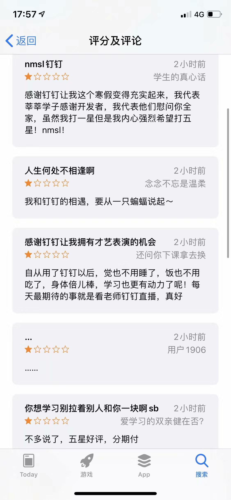

我的钉钉经历要从一只蝙蝠说起....

 

2月1日消息，因新型肺炎疫情，中小学无法如期开学，为响应教育部“停课不停学”号召，钉钉第一时间发起“在家上课”行动计划。该计划启动后，钉钉应用市场评论区出现了一个奇怪的现象，“一星”与“五星”两股势力引发激烈论战。

 

很多学生朋友通过打出一星评价，并在评论区讽刺钉钉的此举“毁”了他们的假期：

 

“感谢钉钉让我度过了一个变态的寒假”

 

“就网上补课以功能而言，呵呵……”

 

“感谢丁丁让我们在这美好的寒假里与作业和老师再次相遇。”

我的看法：

 

我们学校之前使用的是微信，自从学校发现钉钉后，立即转战钉钉。其实微信有很大的弊端，我们老师靠的是语音方阵来为我们讲题，相比之下呢，钉钉功能就比较强大，在线直播授课，共享文件云盘，电话会议（面对面），在线打卡......我觉得最大缺点就是太复杂化，我也是用了很长时间才熟悉如何熟练使用。

 

 

 

钉钉确实是一款好的办公软件呢！

 

总之呢，钉钉赢得一星评价的主要原因是同学们觉得自己的自由生活收到了限制。

 

我想提醒大家，疫情严峻，开学时间未知，我们要把握好时间，不能在家学习就松懈下来，要正确认识学习的重要性，而不是满腹牢骚，报怨人家软件啊！

本文由小艾转自风与天空博客

地址[https://www.windsky.site/index.php/archives/46/](https://www.windsky.site/index.php/archives/46/)
