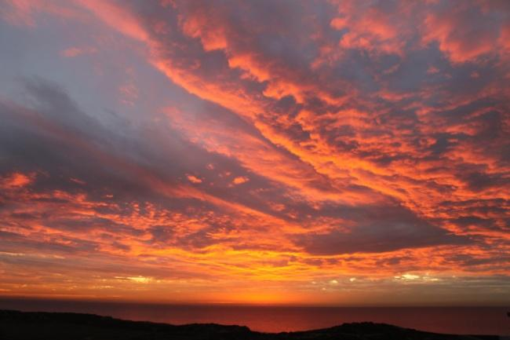

**黄昏还是在黑夜来临之前昏了过去**

小时候黄昏对我们来说，是要回家了。不能到处乱跑了。可每一次黄昏时候都是要看看。那时候不懂的什么，就是单纯的觉得好看。习以为常的可能也就不那么在意了。

今天写语文卷子的时候有一篇文章就是关于黄昏的。我才猛然发现自己多久没有再见到黄昏了呢。在学校的时候大部分都是在教室。等下学了也是天黑了。而且在学校的生活，也没有那么多的心思关注天怎么样了。

有时候放假回家了，也从没有想出去看看的心思。每天就是宅在家里，写写作业玩玩手机。似乎现在都人都是这么过的。喜欢出去看看的人又有多少呢？一个暑假我基本全部宅在家。就是偶尔出去。因为是在农村，出去也是下田干活。每一次都感觉外面很好可是总是匆匆的拍几张照片就回来了。现在越来越多的人喜欢宅在家里。有时候出去走走也好。农村也有农村的好，至少每天起床的时候可以有一群群的小鸟叫你，而且还可以看到好多不同的风景。城市呢？至少欣赏不了落日的余晖。
