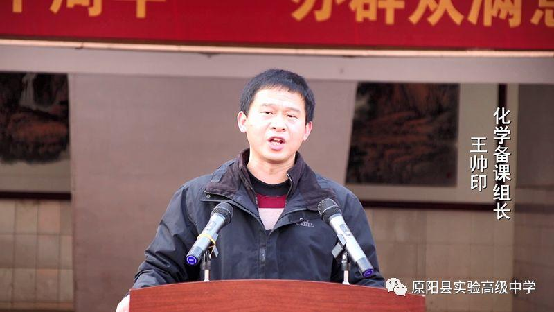

 原阳县实验高中高三年级高考冲刺誓师大会 

阳春已至，惊蛰万物。桃李吐蕊，鸟雀啼鸣。时节虽佳，疫情仍行。这是个特殊的时期，亦是高三学子备战高考的紧要关头。春风吹，号角响，战鼓擂，高三的勇士们在疫情之下，为梦而战。

一

   刘朝阳校长和全体领导班子、高三老师代表、高三学生代表参加了大会。本次大会由高三年级梁兴正主任主持。  

                二

   “做好规划，精准备考”、“注重基础，科学备考”、“提高自律，高效备考”、“树立信心，积极备考”， 针对新冠疫情之下高三学生不能及时返校学习、老师只能通过网络远程教学。贾祥江主任的发言有指导、有要求、有鼓励，切实中肯，可操作性强。

三

     《人生无常，自律为王》疫情突如其来，打破了原定的计划，打乱了原有的步伐，也打坏了原本的心态。在这样一种形式下，自律便显得尤为重要。高三学生代表董晗同学以一位战士的姿态告诉正在备战高考的同学：成人不自在，自在不成人，若要成功，必要自律。   “生于非典，考于新冠”，这不是一个人、一代人的不幸，而是一个国家整个民族乃至人类的灾难。但我们不能畏葸不前、就此止步，更不能做逃兵浑浑噩噩度日。我们要坚持梦想、迎难而上、只争朝夕，在努力奋斗的过程中收获人生别样的风采。高三学生代表梁思楠同学的发言是有志的高三学子共同的心声。                 四    高三学生代表集体宣誓，声声铿锵有力，字字掷地有声。口罩掩住了面容，却挡不住青春的热情。

               五

    在身边，在远方，一位位克服种种困难备考的学子是我们的榜样，也是我们该有的模样。在这短短的90天，我们要努力到最后一秒，相信只要坚持努力，一切皆有可能。2020年爱你们的我们会一直在你们身边陪伴，鲁香芳老师饱含激情又满含深情的如是说。孩子，疫情可以隔开我们在一起的身影，但在你奔向高考的路上，我们不曾分开。

六各科学科组长发言 不因现实复杂放弃梦想，不因理想遥远放弃追求青春有解，美梦会圆成长怎能轻易辜负，破釜沉舟、背水一战

    惯性定能让我们冲破一切阻力，能量定能转化为奋发向上的动力

努力到无能为力，拼搏到感动自己

志存高远，脚踏实地

夯基础，建网络，主干知识要记牢；明设问，析材料，书写规范很重要

信心来自实力，实力来自勤奋

话区位，论发展，精思细琢，厉兵秣马六月

七

   教室里、讲台上、手机中、电脑旁，知识是弹药，笔是刀枪。握住的拳，握住的是希望；伸出的掌，托起的是阳光。铮铮誓言，拳拳爱心，涓滴努力必将汇成海洋。高三老师代表集体宣誓。   

                     八

刘朝阳校长的讲话有诗一样的文字，火一样的情怀。他高屋建瓴、深入浅出，以科学的理念条分缕析、谆谆教导，为高三学子鼓足劲头，指明方向。 

     勤努力数载寒窗，借东风青云可上。新冠疫情是挑战亦是机遇。在这个漫长的假期，学子们，愿你们以梦想为船，自律为帆，努力为桨，驶向六月成功的彼岸。

                                                          撰稿：肖艳玲

本篇文章来源于微信公众号: 原阳县实验高级中学 如有疑问联系站长删除
