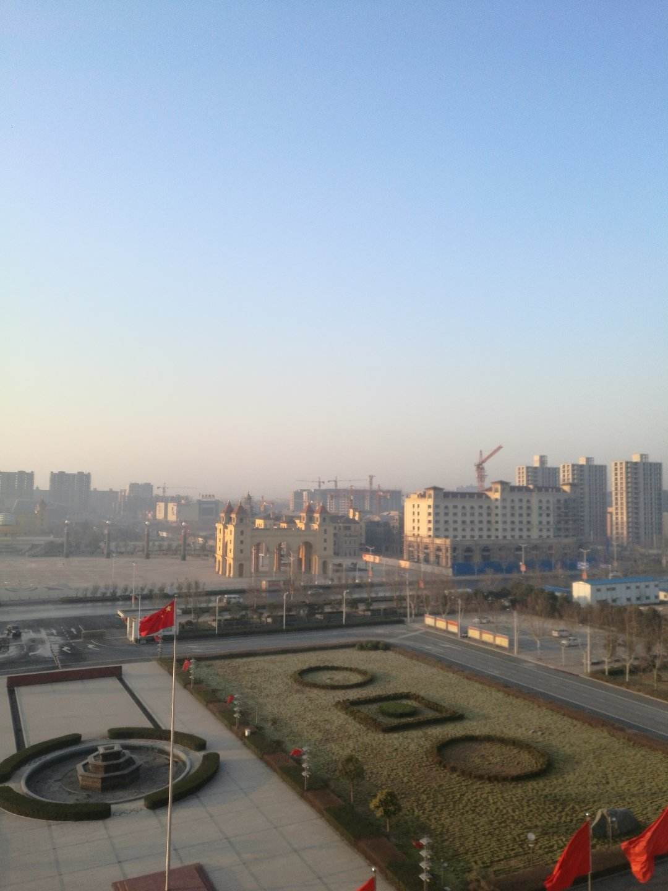

<figure>

<figcaption>

原阳是个好地方  
原阳县县歌

</figcaption>

</figure>

原阳是个好地方

作词：赵光岭

作曲：曹 进

演唱：于丽娜

爱我大

原阳

水之滨，山之阳，原阳是个好地方。

九曲黄河门前过，蜿蜒金堤入画廊。

历史承载故事多，宰相之乡美名扬。

啊，美丽的原阳，源远流长！

云淡淡，鸟飞翔，原阳是个好地方。

天蓝草青百花艳，依城傍水好风光。

广袤河滩牛羊肥，田园似锦稻花香。

啊，美丽的原阳，令人向往的地方！
