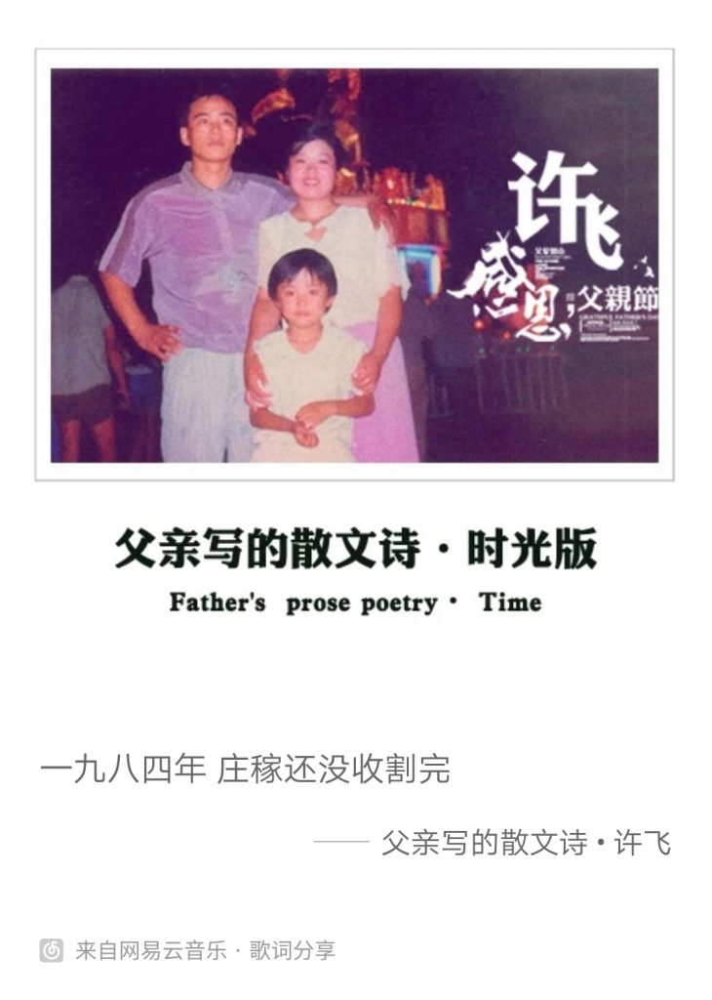

<figure>

<figcaption>

父亲写的散文诗

</figcaption>

</figure>

[热门歌曲](/)

- 

歌词：

父亲写的散文诗 - 李健作词：董玉方作曲：许飞编曲：刘卓原唱：许飞一九八四年 庄稼还没收割完儿子躺在我怀里 睡得那么甜今晚的露天电影 没时间去看妻子提醒我 修修缝纫机的踏板明天我要去 邻居家再借点钱孩子哭了一整天啊 闹着要吃饼干蓝色的涤卡上衣 痛往心里钻蹲在池塘边上狠狠给了自己两拳这是我父亲日记里的文字这是他的青春留下留下来的散文诗多年以后 我看着泪流不止我的父亲已经 老得像一个影子一九九四年庄稼早已收割完我的老母亲去年 离开了人间儿子穿着白衬衫 跑进了校园可他最近 有些心事瘦了一大圈想一想未来我老成了一堆旧纸钱那时的儿子已是真正的男子汉有个可爱的姑娘 和他成了家但愿他们不要活的如此艰难这是我父亲日记里的文字这是他的生命 留下留下来的散文诗多年以后我看着泪流不止可我的父亲已经老得像一个影子这是我父亲日记里的文字这是他的生命 留下留下来的散文诗多年以后我看着泪流不止可我的父亲在风中像一张旧报纸这是那一辈人留下的足迹几场风雨后就要抹去了痕迹这片土地曾让我泪流不止可它埋葬了多少人心酸的往事

网易热评

2006夏天。我拿着中考成绩单，狂奔向还在田边插秧的父母。告诉他们我考上重点高中了，父亲把秧苗一扔。走，回家吃饭去。\[流泪\]\[流泪\]\[流泪\]

“我自问这辈子没做过坏事，为什么要被生活勒住喉咙。”爸爸在日记里写到。

明天是父亲节 恐怕是我生命中的最后一个父亲节了 父亲肺腺癌晚期 怕是.... 此时此刻 我远在2000多公里的大学图书馆里 想念着父亲 还有15天 才能回去 父亲 加油！女儿一直都在！

二十年前。“爸爸，这是什么呀”“爸爸，他为什么会这样”“爸爸，你看这个，怎么回事啊”“爸爸，你连电视都会修啊”二十年后。“儿子，你玩的这是什么”“儿子，你帮我看看怎么不动了”“儿子，这个为什么一闪一闪的”“儿子，你连电脑都会修啊”

父亲才写了几句话，字里行间却充满一生为家庭为孩子默默付出的辛酸。许飞唱得让人想哭，父母不容易，好好爱他们。

[小艾同学](/)
