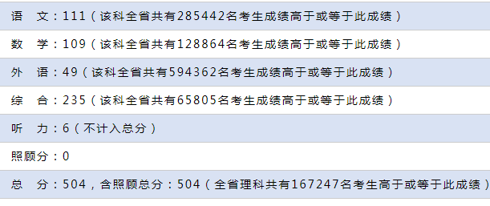
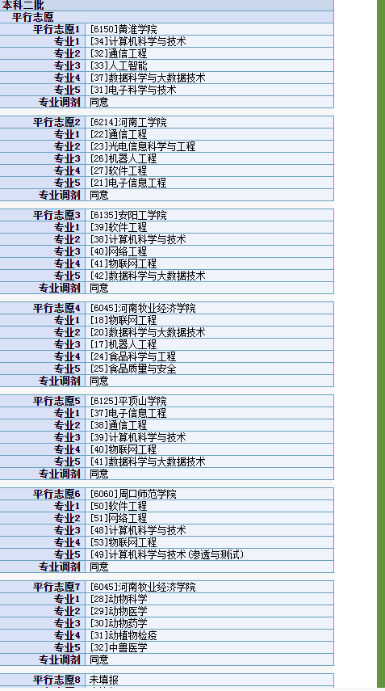

紧张了一年高中也到此结束，不过紧张到也未必，也有一段时间也是混混噩噩不过还好总算结束了。结果呢大概也满意虽然没有达到最初的目标。但是自己努力多少自己也清楚，所以也就不去抱怨什么了。

理综不是很满意，选择都120总分才235.........................

不过其他还可以，并且语文远远超过我的想想，平时也就九十来分的，结果111倍儿爽。

都说高考志愿都是前面的冲一冲，我感觉这样其实不好，我想去自己想学的专业，所以前面如果是用来冲一冲的。那么肯定是不好的专业。相对来说我更喜欢自己喜欢的专业所以黄淮我来了。有的人说可以转专业，但是我想了想。计算机一般都是热门专业、专业肯定不容易。不然全部都去热门专业了。

我感觉我会成为黄淮的一份子，希望最终的去向是黄淮。所有的院校我基本全是填的和计算机相关专业。其实我还是有点由原因的，原因很简单，看看我英语多少分就知道了。最后保底的是牧业经的单列专业。除了计算机外我最感兴趣的就是生物学了 。但是对计算机的爱好远远超过生物学。有缘就在黄淮遇见吧！
