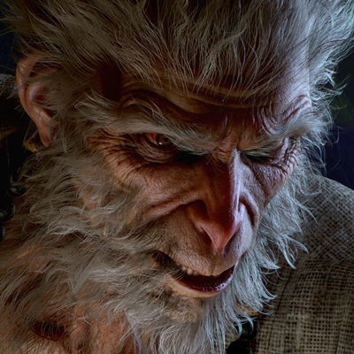

<iframe src="//player.bilibili.com/player.html?aid=841786906&amp;bvid=BV1x54y1e7zf&amp;cid=226204073&amp;page=1" scrolling="no" border="0" frameborder="no" framespacing="0" allowfullscreen="true"></iframe>

虽然小艾不是一个游戏迷但是只看这个游戏的美工方面已经非常好了。

有一天没先到总算不用玩汉化的 游戏了，坐等悟空出现，让老外自己去英化?（虽然可能等好多年）真希望他们这个团队每过一段时间就更新一个视频，不让悟空沉下去。不过我在网上看到他们这个团队被挖墙脚了。。。。。。

我看了 几遍这个实机演示，说真的我自我感觉最吸引我的就是剧情，从开始到结束出现的几个人（猴子）到底谁是真的孙悟空他们啥关系啊。而且最不解的就是土地公公的那番话，“像，太像了。”貌似他似乎知道些什么。而且在庙前面讲的一番话似乎也有更深的含义。从刚开始的一个小boos劝他放下棒子，学习佛法似乎乱套了，和我们想的不一样，而且最后准备一棒打死大boos时候又一只猴子出现了，拦下了他的棒子。善于恶真的是完全对立吗？一切只因等几年后的某天了。

希望他们这个团队可以做到最后吧
