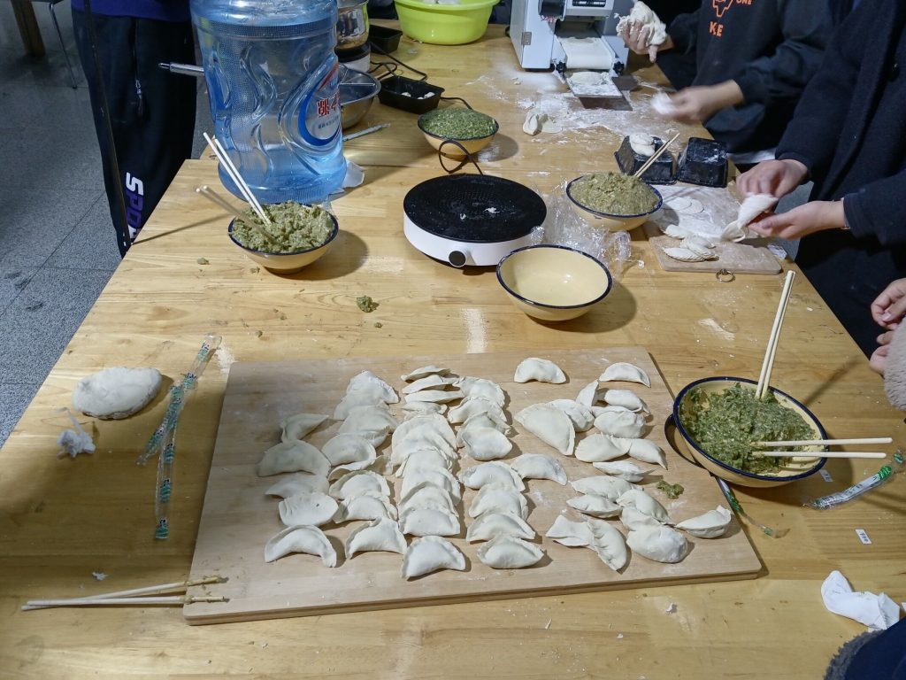
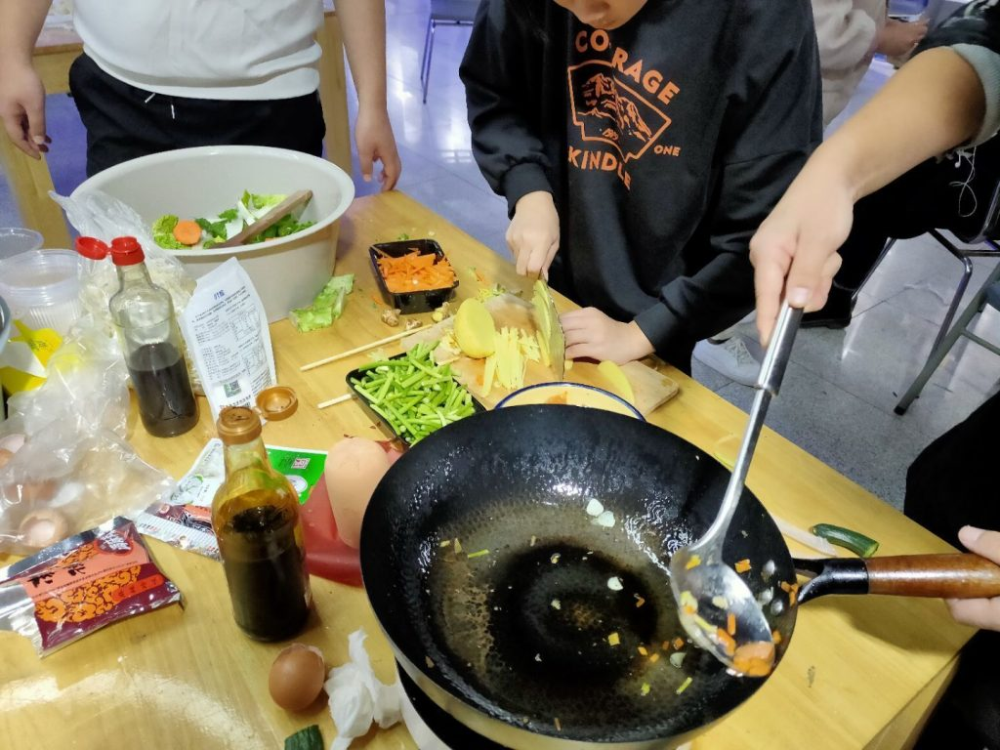
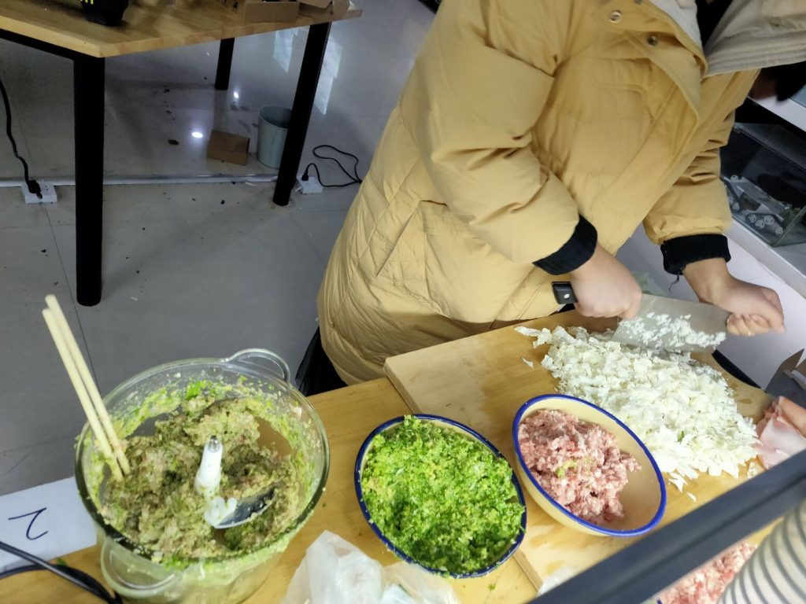
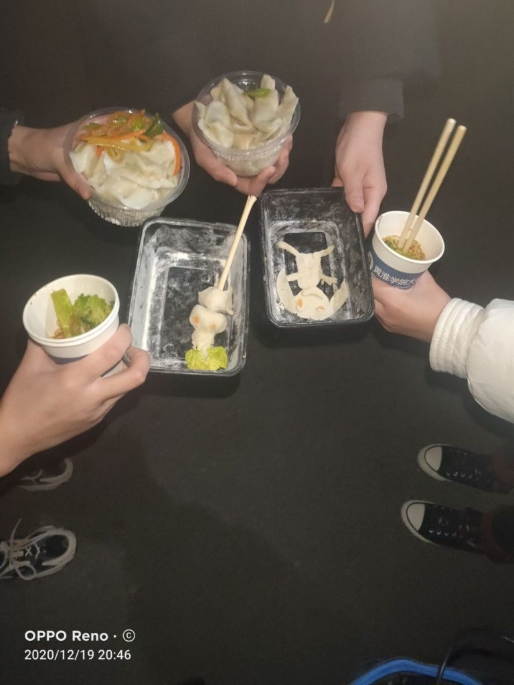
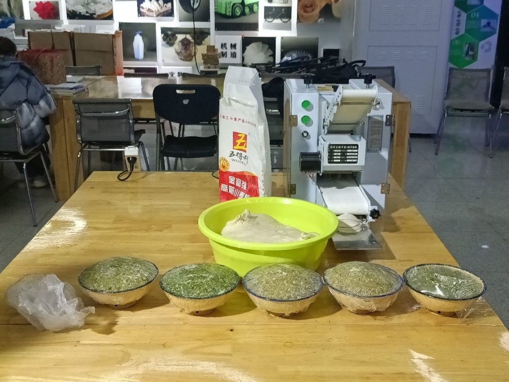
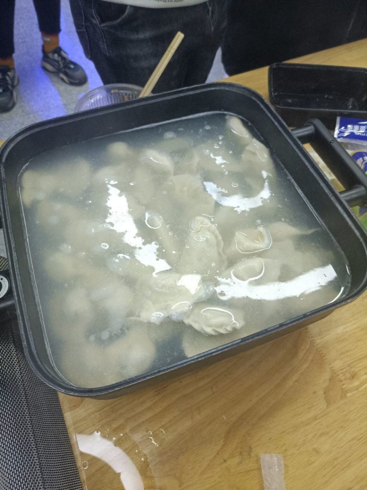
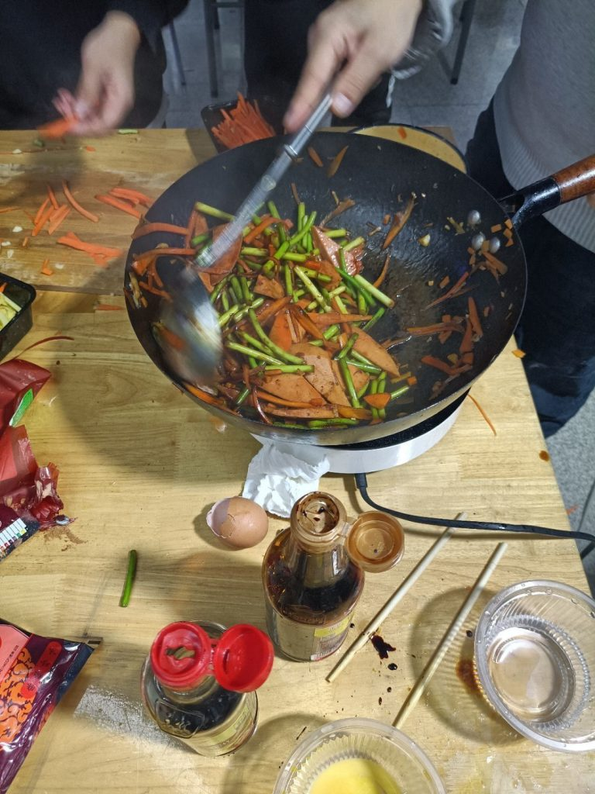
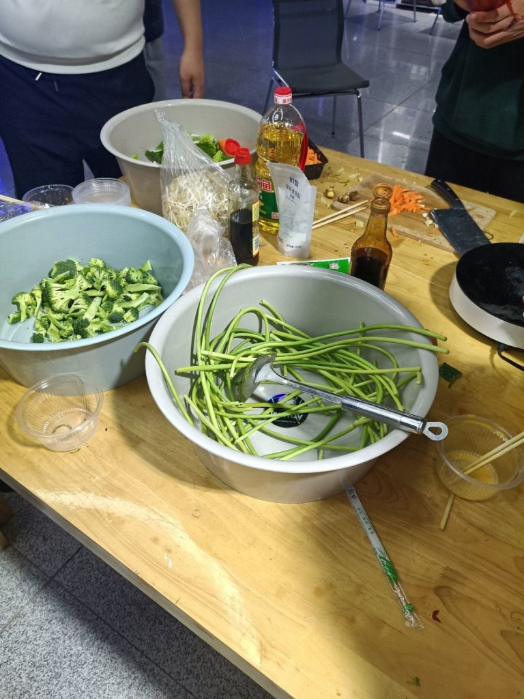
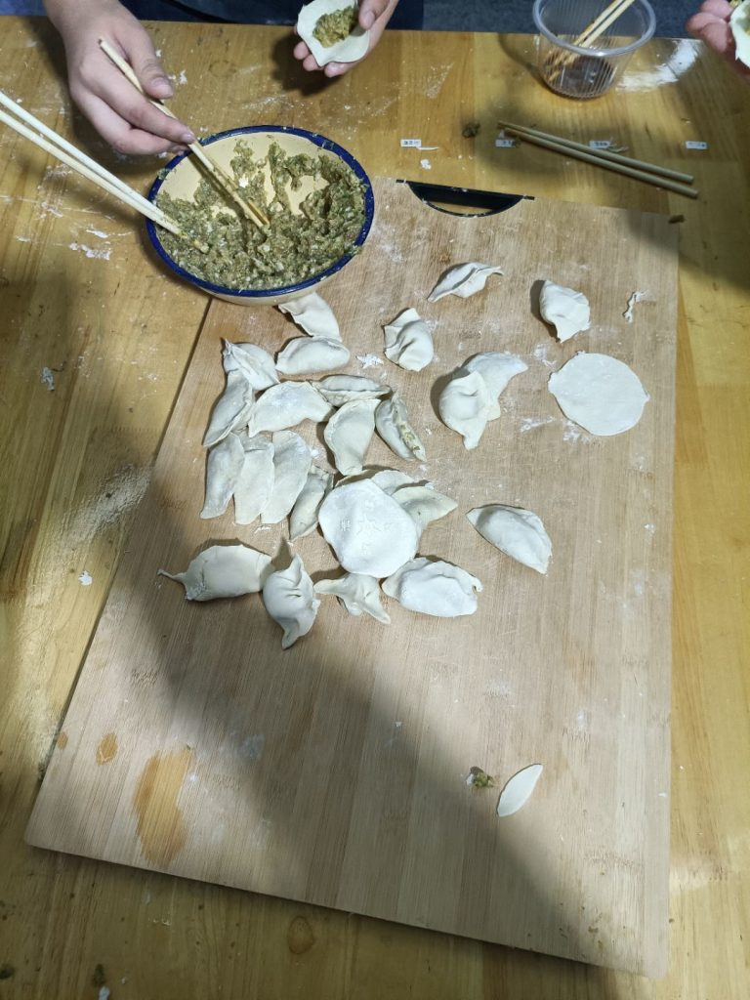
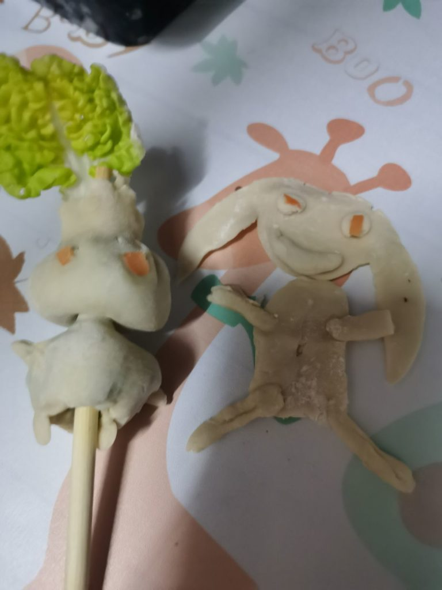

冬至马上就要到了，出乎意料的，没想到大学也包饺子活动，当然了不仅班级有，我想加入的创客空间也有，当然遗憾的是由于各种因素，我去不了QAQ，只能在宿舍当一条咸鱼了。虽然我不在现场，但是还是有照片记录下了分享下。

<figure>

- 
- 
- 
- 
- 
- 
- 
- 
- 
- 

<figcaption>

黄淮学院创客空间包饺子活动

</figcaption>

</figure>

哎，遗憾啊错过了一场活动，既然是创客，那么包饺子肯定少不了各种神奇的机器，（虽然我没见，也没吃QAQ)。欲知具体详情，请期待下一年的吧！！！要是下一年我没参加就下下年吧?

（成功水了一篇文章）
