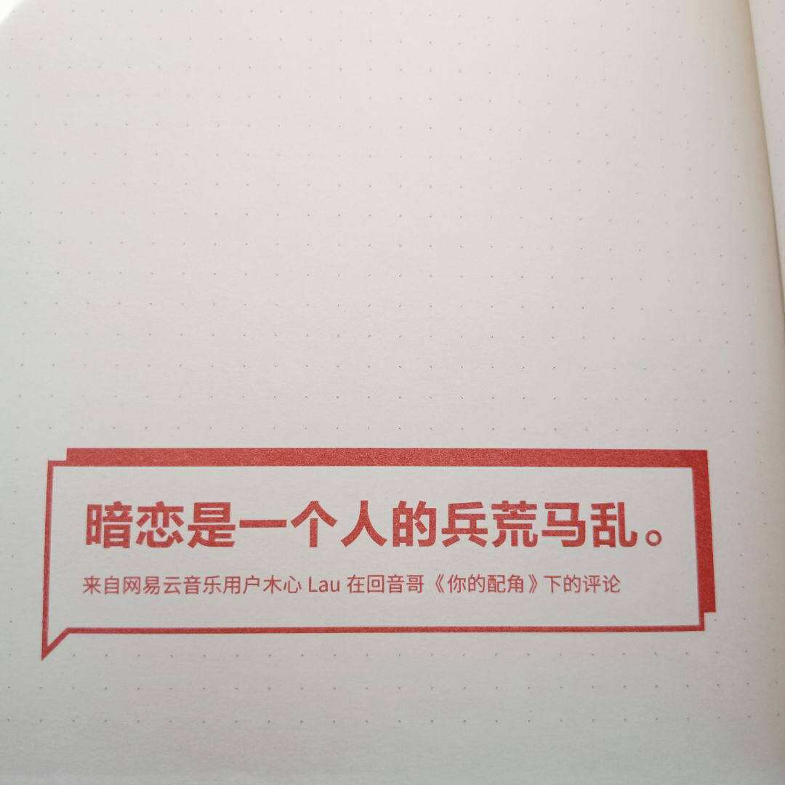

这几天在群里闲聊，发现一位大佬写了个api感觉好牛逼就想自己也写个。但是我完全不懂代码就百度搜索自己了解。嗯网上大部分都是Python采集。但是我想php。没找到教程。看了大概还加密数据了难受。想了又想算了。还是采集别人接口数据吧(///ˊㅿˋ///)

由于对php一无所知就去搜各种函数。嗯还凑活

但是他接口是随机内容，所以我挂了个监控一直更新，但是每一条都要与保存的数据对比是否重复。嗯我发现了它接口返回值id是唯一的。所以我就把数据库添加id字段然后设置成唯一。大功告成。这样我就避免重复内容了。剩下的就是读取数据库内容随机输出了。本想写个前段但是对编程一无所知的我就放弃了。查资料好慢(✪▽✪)问题好多。最尴尬是我写输出json内容时。我竟然是手动转换json的。字符串什么的都是一个个敲出来。然后被人笑了一番。才知道那用那么麻烦，有个函数可以吧数组转换成json尴尬啊！没有代码高亮插件。就不发出来了。要的话可以留言给我。

 

网易热评API地址[https://api.aunm.cn/wangyi](https://api.aunm.cn/wangyi)

参数打开就可以看到了。
