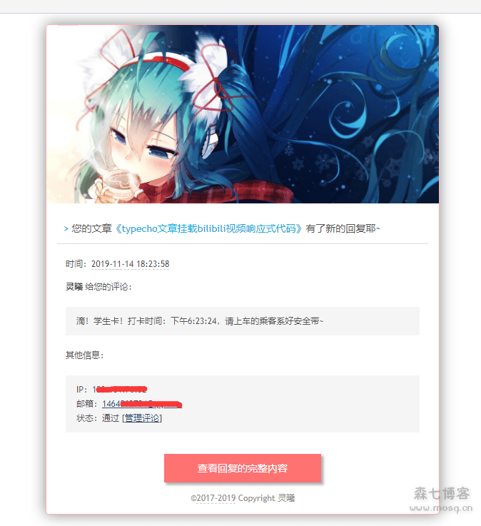

这个插件在森七博客看到，感觉不错转载咯

插件介绍：

访客评论后，将会发送评论内容到您指定的邮箱。

原作者是 DEFE (defe.me)。

个人原因不再维护，所以？在其最终版本1.2.6的基础上继续维护更新。

（ps：这款插件森七也不知道在哪里找到的了，插件里的网址也失效很久了，虽然来自很多年前的插件 但不可否认的是非常好用，并且森七自己也在用。如果出现了不发信，先看看发信端口是否打开）

好了下载链接附上[https://t00y.com/file/14165255-409924824](https://t00y.com/file/14165255-409924824)

本文转自森七博客原文链接[https://www.mosq.cn/post-477.html](https://www.mosq.cn/post-477.html)
