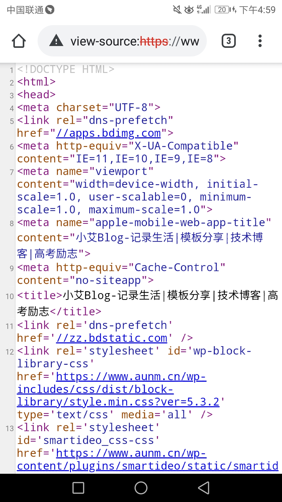
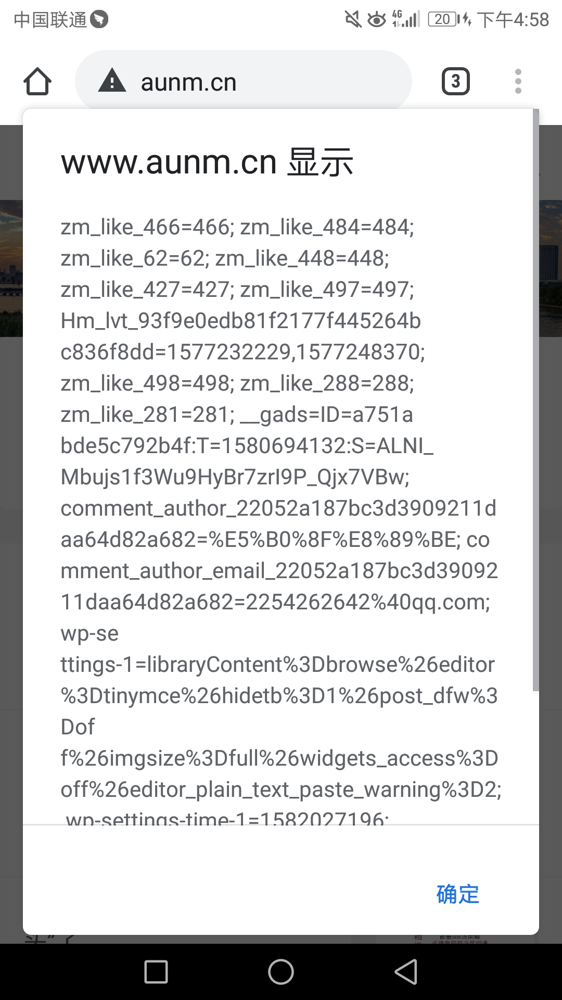

先附上照片

 

希望可以帮助需要的人。

查看网站cookie只需要在当前页面的网址输入框打上

JavaScript:alert(document.cookie)

回车就ok了。但是小艾用的时候发现如果直接把上面的语句粘贴到浏览器，浏览器会把JavaScript自动忽略。所以前面的我还是建议手动打进去

查看网站源码呢很简单只需要在网站前面加上view-source:即可

例如view-source:http://www.xaitx.com

好了还有一个重要问题。在小艾实验过程中发现上面两种方法不是对所有浏览器都支持。。。比如QQ浏览器一个都不支持。但是谷歌浏览器不错都支持哦。
