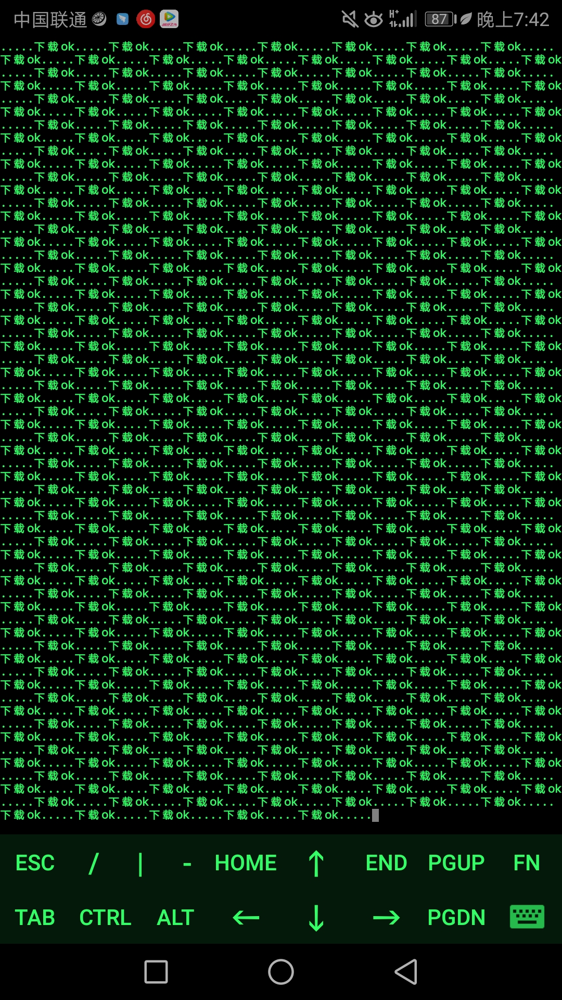

小艾也是小白这个代码还是百度函数一个一个搜索拼成的哈哈（大佬勿喷反正功能已经实现）

这个代码改过一次，第一次逻辑问题。。。。。。

第二次。。。。哎呀反正功能实现了，但是缺点是每一次运行都是从第一篇开始，，，，也懒得写了反正功能实现了嘻嘻



注：大佬看见变量名别笑喷啊

命令行运行吧

index.php

```
<?php include('function.php'); $wuliao=5;//采集个数可以修改 $files_name=0; $id0=12; //图片匹配正则 $img="#http://img\.ciyuandao\.com/.{20,60}jpg#"; do { $url0='http://ciyuandao.com/photo/show/'.$id0; $date=file_get_contents($url0); $cishu=preg_match_all($img, $date, $m1); $id=0; do { $imgurl=$m1[0][$id]; $save_to='./img1/'.$files_name.'.jpg'; xiazai($imgurl, $save_to); sleep(1);//暂停1s echo('下载成功.....'); $id++; $files_name++; } while($id<$cishu & $files_name<$wuliao); $id0=$id0+1; } while($files_name<$wuliao); ?>
```

#### function.php

```
<?php function yuanma($url){ $ch1 = curl_init(); curl_setopt($ch1, CURLOPT_URL, $url); curl_setopt($ch1, CURLOPT_HEADER, 0); curl_setopt($ch1, CURLOPT_TIMEOUT,10);//置cURL允许执行的最长秒数 curl_setopt($ch1, CURLOPT_RETURNTRANSFER, 1); curl_setopt($ch1, CURLOPT_SSL_VERIFYPEER, false);//这个是重点。 curl_setopt($ch1, CURLOPT_SSL_VERIFYPEER, FALSE); // https请求 不验证证书和hosts curl_setopt($ch1, CURLOPT_SSL_VERIFYHOST, FALSE); $data = curl_exec($ch1); curl_close($ch1); return $data; } function xiazai($xz_url,$mulu){ $ch = curl_init(); $fp=fopen($mulu, 'w'); curl_setopt($ch, CURLOPT_URL, $xz_url); curl_setopt($ch, CURLOPT_FAILONERROR, true); curl_setopt($ch, CURLOPT_FOLLOWLOCATION, true); curl_setopt($ch, CURLOPT_RETURNTRANSFER, 1); curl_setopt($ch, CURLOPT_CONNECTTIMEOUT, 100); curl_setopt($ch, CURLOPT_SSL_VERIFYPEER, false); curl_setopt($ch, CURLOPT_SSL_VERIFYHOST, false); curl_setopt($ch, CURLOPT_FILE, $fp); $output = curl_exec($ch); $info = curl_getinfo($ch); $error = curl_error($ch); fclose($fp); $size = filesize($mulu); if ($size != $info['size_download']) { return "下载失败"; return $error; } else { return "下载成功"; } curl_close($ch); } ?>
```
