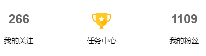

今天无聊去抓包了学校一个乌托邦小程序，原本是打算去写个自动发帖凑下人气，结果抓包分析过后，呃呃呃发现了一些bug，

首先参数分析，其中最重要的就是token 和id我抓包了直接去试了，就这俩参数还不会变呃呃神奇。

然后我就写个了程序关注了一些账户。然后用户id看起来应该是递增的所以直接暴力枚举，发现大概用户有一千一百多人。

而且我发现了这个用户信息的返回json中包含用户手机号。这隐私直接返回给前端，就太随便了把。随后突发奇想测试了下如果关注者id和被关注id换一下。让后呃呃，成功关注。看来这个程序明显没有验证，那么也就证明这个系统的数据验证不全面。

注：后来我分享给我朋友了，结果发现呃呃，用户信息值返回json中有id和token我\*\*\*\*\*，这也太无语了。

接口啥的就不发布了，也别去测试了，坐等官方修复吧！
