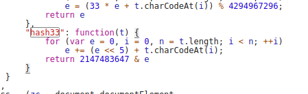

qq扫码登录，验证码状态验证是需要参数ptqrtoken在进过浏览器js调试发现了下面的函数，测试一下加密结果一样。

很显然就是这个加密方法了。



转换为python就是

```
def hash33(t):
    e = 0
    for i in range(len(t)):
        e += (e << 5) + ord(t[i])
    return 2147483647 & e
```
