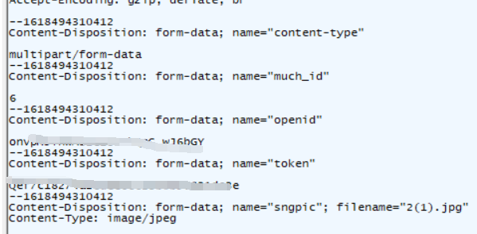

在研究学校的小程序文件上传中，发现了一个让人头大的数据传送方法。



看的我一脸蒙圈，第一次遇见这种的，不过我看这和json传送方法好像，都是数据流方法。

```
Content-Type: multipart/form-data; boundary=${boundary} 
```

数据解析远离就是在请求时候，会在头部加上

然后在请求数据中就用${boundary}分割开，传到后端再进项分割。

```
POST http://www.example.com HTTP/1.1
Content-Type:multipart/form-data; boundary=----WebKitFormBoundaryyb1zYhTI38xpQxBK

------WebKitFormBoundaryyb1zYhTI38xpQxBK
Content-Disposition: form-data; name="city_id"

1

------WebKitFormBoundaryyb1zYhTI38xpQxBK
Content-Disposition: form-data; name="company_id"

2
------WebKitFormBoundaryyb1zYhTI38xpQxBK
Content-Disposition: form-data; name="file"; filename="chrome.png"
Content-Type: image/png

PNG ... content of chrome.png ...
------WebKitFormBoundaryyb1zYhTI38xpQxBK--
```

很明显上面这个就是WebKitFormBoundaryyb1zYhTI38xpQxBK，然后后端进行分割处理。大部分应该都是用来传输图片等文件的。但也有时用来传输参数

附上一段我用python写的请求

```
payload = {
    'content-type': 'multipart/form-data',
    'much_id': (None,'6'),
    'openid': (None,openid),
    'token': (None,token),
    'sngpic': ('a.png',open('a.png', 'rb'), 'image/jpeg')
}
r = requests.post(url, headers=header, files=payload)
```
