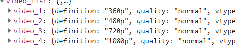
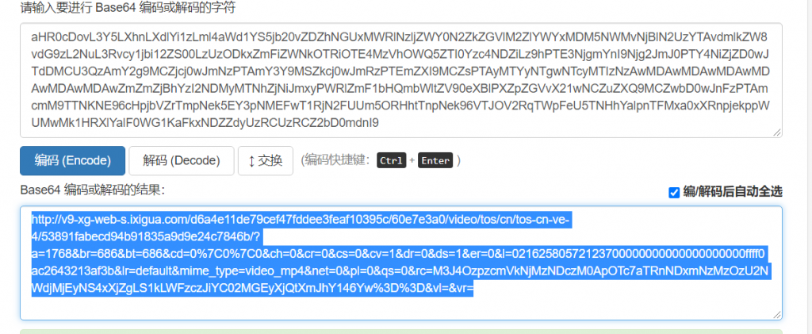

直接上成品吧，分析过程就忽略了（因为也没啥，度娘保命）

刚开始我主要是想下载某一个用户的全部视频所有呢，首先就要先找到他获取视频方法

### 接口一

```
https://www.ixigua.com/api/videov2/author/new_video_list?to_user_id=50953987045&offset=0&limit=30&order=new
```

参数就是很明显了50953987045是用户的id后面俩就是获取多少个，最后一个是排序方法，然后get请求就完了

重点：这个接口请求必须带上**referer**有请求头验证呃呃。

然后很自然的获取到了每一个视频的信息。我们下载视频主要是用id所有利用视频id进行请求，再来看第二个接口

### 接口二

```
https://www.ixigua.com/api/public/videov2/brief/details?group_id=6976820974264156686
```

获取视频的详情信息

返回的数据中包含好几个清晰度



然后选择自己需要的里面有个参数名为 main\_url 的键值，很明显base64编码解析一下



解析后就是视频的地址了。
