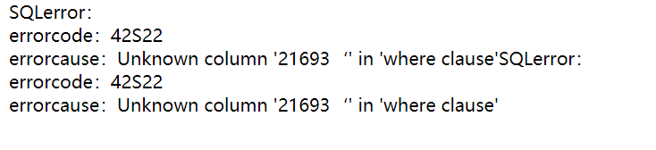
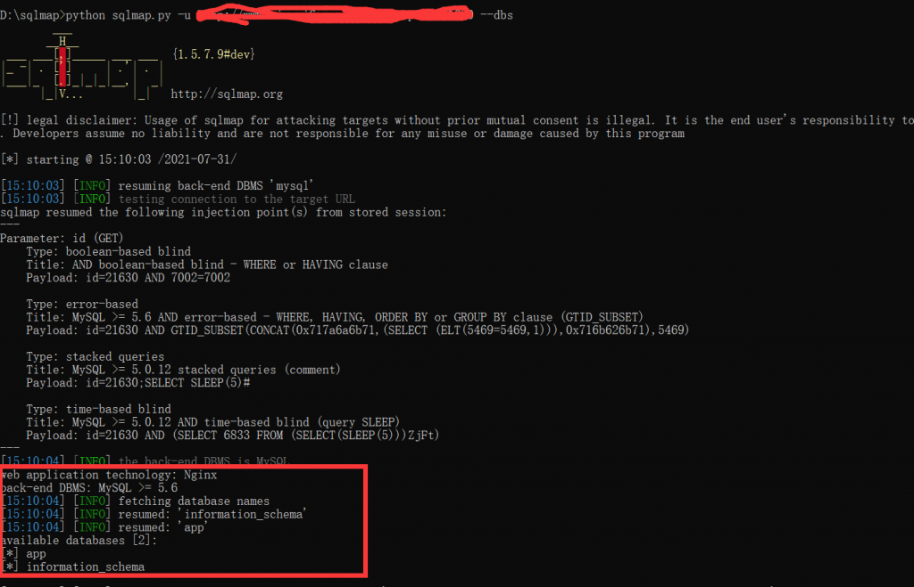
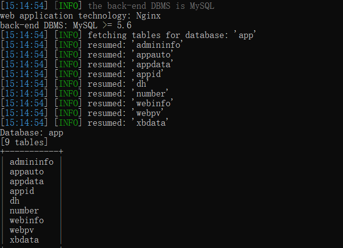
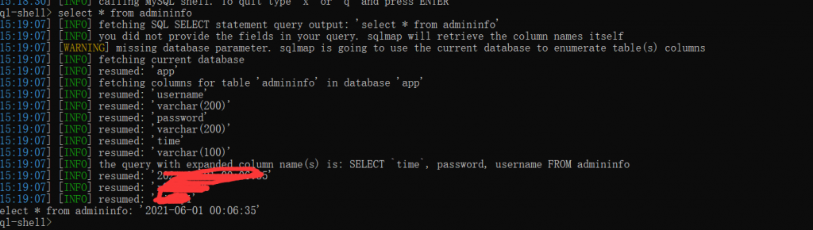
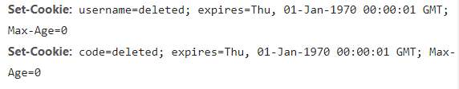

### 开始

在逛莫网站时候无聊输入'测试了下



有没有一种激动的心情？？直接搬出sqlmap神器。

### 开始测试

#### 首先爆破数据库名称

```
python sqlmap.py -u xxxx --dbs
```



爆出来了数据库，很自然app就是这个网站的数据库，下一步

#### 爆破表名称

```
python sqlmap.py -u xxxx -D app --tables
```



很简单我们就看到了我们的目标了，对没错就是admininfo下面就他了

#### 获取表内容

这一步比较简单了，按照往常应该爆破字段然后根据字段查询内容，也有另一个简单的

```
python sqlmap.py -u xxxx --sql-shell
```

这个是进入sql交互的命令模式所以有时很方便。直接执行

```
select * from admininfo
```



用户名密码就很简单的出来的了。下面就是进入后台看看了，

### 找到账号密码后

我直接在输入admin目录后直接给我跳转到了login.html但是这个页面是404很自然的他修改了防止别人爆破。我在御剑里跑了下试着看看有没有有用的目录文件。最后在不断测试中，发现了他后台退出登录的文件。



很自然这个username和code就是登录凭证。username都知道是啥，但code呢？我知道数据库中有几个code的字段，但这个呢，抱着试一试的态度的态度吧username修改成了获取的名字。然后就是在我一脸懵逼的注视下进入了后台。但是这个后台太简陋了吧，一个类似资源网的网站后台就个添加删除文章，而且图片一律输入url上传接口都没，然后就没思路了、后来想想数据库呢（其实基本所有的网站的数据库都不是root用户）不死心的试了试果然权限不够。然后就没然后了。

这个站也没啥好玩的。又研究一番放弃后，把漏洞提交给了网站管理员了。不过现在网站的sql注入真的少见了。
