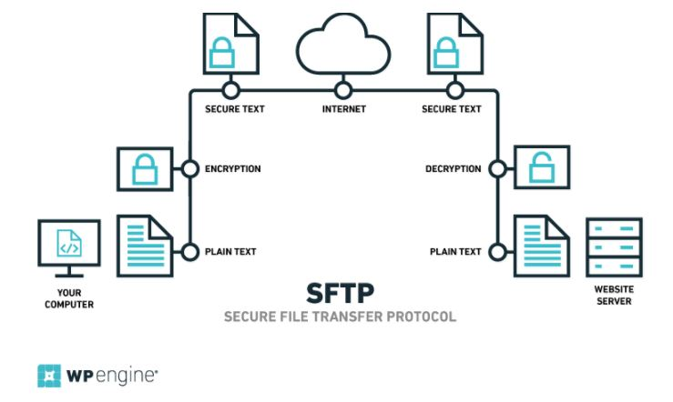

### 介绍



> sftp是Secure File Transfer Protocol的缩写，安全文件传送协议。可以为传输文件提供一种安全的网络的加密方法。sftp 与 ftp 有着几乎一样的语法和功能。SFTP 为 SSH的其中一部分，是一种传输档案至 Blogger 伺服器的安全方式。其实在SSH软件包中，已经包含了一个叫作SFTP(Secure File Transfer Protocol)的安全文件信息传输子系统，SFTP本身没有单独的守护进程，它必须使用sshd守护进程（端口号默认是22）来完成相应的连接和答复操作，所以从某种意义上来说，SFTP并不像一个服务器程序，而更像是一个客户端程序。SFTP同样是使用加密传输认证信息和传输的数据，所以，使用SFTP是非常安全的。但是，由于这种传输方式使用了加密/解密技术，所以传输效率比普通的FTP要低得多，如果您对网络安全性要求更高时，可以使用SFTP代替FTP。
> 
> 百度百科

### 使用

这里我们用sftp来对远程服务器和本地电脑上文件进行上传，下载操作

连接远程服务器：

```
sftp username@ip
```

  
回车之后输入服务器密码即可连接成功。

将文件上传到服务器上：

```
put [本地文件的地址] [服务器上文件存储的位置]
```

  
将服务器上的文件下载到本地：

```
get [服务器上文件存储的位置] [本地要存储的位置]
```
