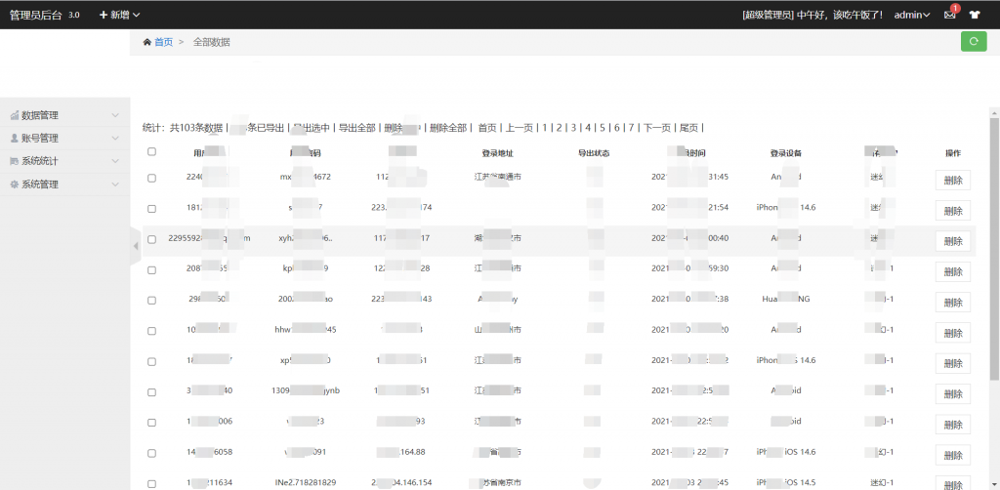

### 前言

前几天在群里有人发了个钓鱼网站，然后正义的我怎么能允许这样的存在，直接拿着就是一段研究，最后呃呃就是提交了点垃圾数据就去打游戏了(⊙﹏⊙)。

不过昨天晚上无聊想着这钓鱼网站的后台管理应该简单吧，根据提示知道了账号是admin那就直接跑密码吧。

首先是字典，然后下载一个字典。好家伙直接一百多兆。直接卡了嘶。后来就换成个常见弱口令的字典不到两万条。运气不错，跑了大概5000多就跑出来了。

嘶，这个还不算多。一百多条呃呃。

测试后发现也没啥发现（技术菜）。干脆直接删库跑路（反正他是钓鱼网站，省的利用这给别人发广告）溜了溜了。不用谢我，好事从不留名。?

这种暴力破解不仅费时，而且能爆出密码的概率贼低呃呃。不要太有幻想了。
