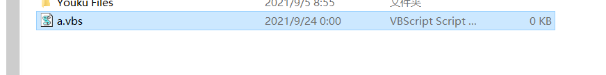
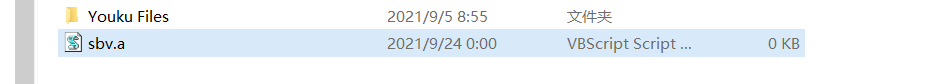

这个RLO是Unicode为了兼容阿拉伯文字从左至右的阅读习惯设计的一个转义字符

例如我创建一个脚本

<figure>

<figcaption>

那么我直接在a前面插入这个控制字符呢

</figcaption>

</figure>

<figure>

<figcaption>

直接反转过来了

</figcaption>

</figure>

是不是很神奇。

那么我是不是可以改改名字构造出jpg，png txt之类的文件呢然后写入恶搞的代码，那岂不是可以骗过一些人了?

当然了，这个我看其他博主说你可以在qq昵称之类地方试试。也会有出其不意的效果，具体就自己测试吧。

对了重要一步咋插入这个字符，在电脑上直接邮件插入Unicode字符选择RLO就行了、
