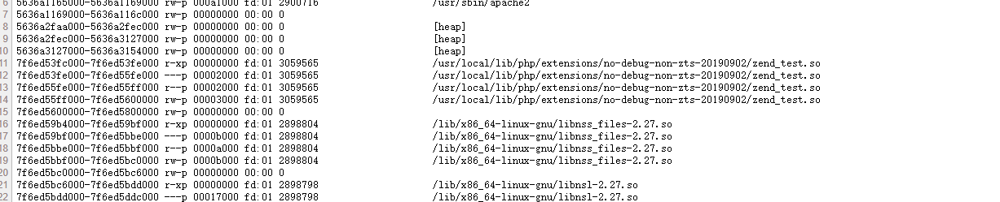
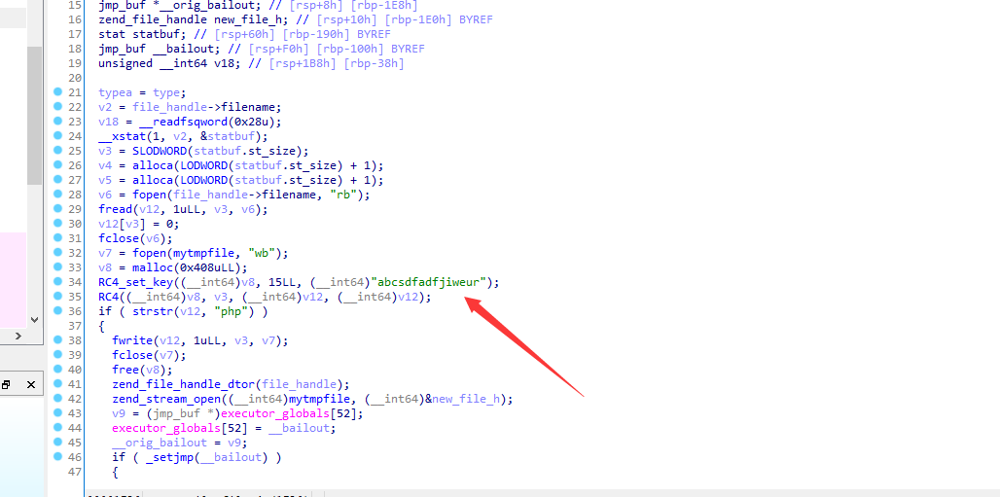
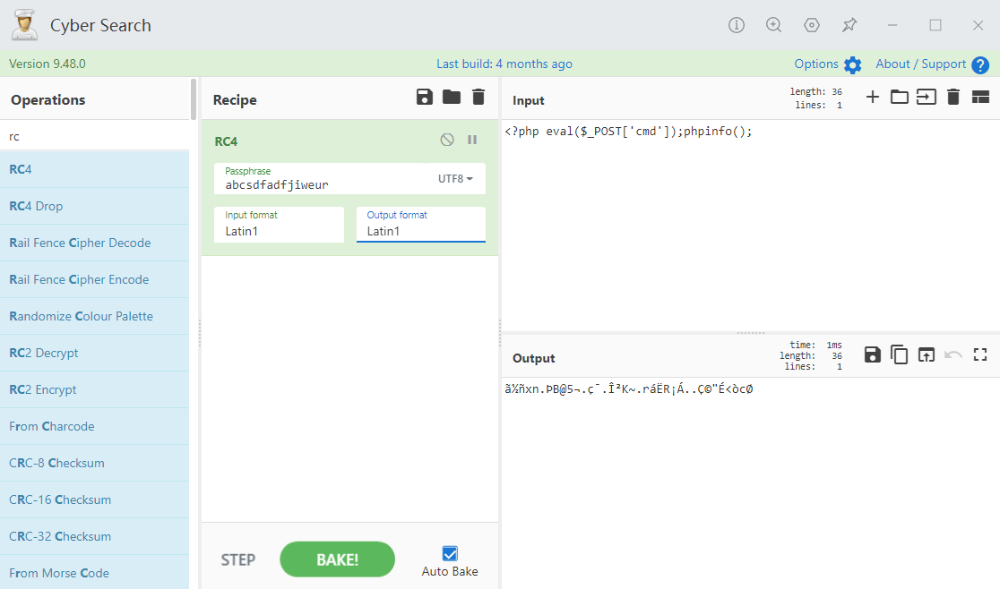

#### 题目一名称：unusual php

1. 打开贴出了源码

发现可以文件上传然后直接上传php

发现提示错误 php没有解析成功

然后读取index.php 发现乱码

猜测后端处理应该有解密的操作，

在 上传文件时候贴上读取的index.php 解析正常 验证了猜想

然后在后面补充任意字符换行最后报错提示了/tmp/fuck.php

然后寻找加密猜测应该是有依赖通过对/proc/self/maps读取发现了

[](https://www.xaitx.com/wp-content/uploads/2023/02/1675335485-1.png)

然后把zend\_test.so 下载下来逆向分析

[](https://www.xaitx.com/wp-content/uploads/2023/02/1675335560-2.png)

 

 

发现处理原理，解析时候先把文件读取然后rc4解密写入缓存文件/tmp/fuck.php （必须包含php字符串）

还有密匙直接构造一个加密的webshell上传

 

[](https://www.xaitx.com/wp-content/uploads/2023/02/1675335588-3.png)

 

成功解析shell

然后读取/flag发现权限不足

测试后发现可以执行chmod

然后直接给flag权限然后读取

sudo chmod 777 flag

#### 题目二名称：Node Magical Login

1. flag1 直接修改cookie附带user=admin然后查看响应头
2. 然后想办法得到flag2

```
function CheckController(req,res) {
 let checkcode = req.body.checkcode?req.body.checkcode:1234;
 console.log(req.body)
 if(checkcode.length === 16){
 try{
 checkcode = checkcode.toLowerCase()
 if(checkcode !== "aGr5AtSp55dRacer"){
 res.status(403).json({"msg":"Invalid Checkcode1:" + checkcode})
 }
 }catch (__) {}
 res.status(200).type("text/html").json({"msg":"You Got Another Part Of Flag: " + flag2.toString().trim()})
 }else{
 res.status(403).type("text/html").json({"msg":"Invalid Checkcode2:" + checkcode})
 }
}
```

发现 只要触发异常就可以得到flag

根据参数解析的库得到穿个数组就可以触发

```
checkcode=1&checkcode=1&checkcode=1&checkcode=1&checkcode=1&checkcode=1&checkcode=1&checkcode=1&checkcode=1&checkcode=1&checkcode=1&checkcode=1&checkcode=1&checkcode=1&checkcode=1&checkcode=1
```

#### 题目三名称：扭转乾坤

直接上传文件提示：禁止 multipart/form-data 类型 然后测试后发现 直接大小写替换成功返回flag

(⊙﹏⊙)
